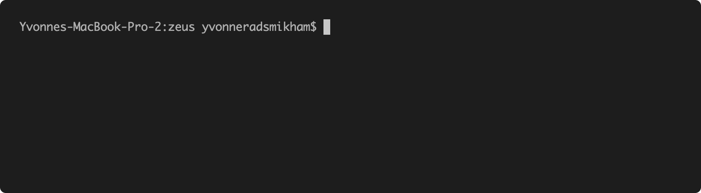

# Zeus - A CLI for OHDSI on Azure

Welcome to Zeus!

The objective of this project is to significantly reduce the time and cost for deploying an instance of OHDSI CDM on Azure. Zeus is a command line interface (CLI) that allows for easy deployment and management of OHDSI CDM resources in Azure.

## Prerequisites

1. Terraform resources deployed in Azure
2. Login to Azure:

```
az login
az account set --subscription <subscription-id>
```
3. Set environment variables:

AZURE_DEVOPS_EXT_PAT: Personal Access Token created in Azure DevOps
AZURE_DEVOPS_EXT_GITHUB_PAT: Personal Access Token Created in Github with recommended scopes -- repo, user, admin:repo_hook

### Common Commands:

- Check for prerequisites (i.e. TF, az, azure devops ext, git), import pipelines to Azure DevOps (if they don't already exist)

```
zeus init --env dev --org https://dev.azure.com/<organization> --proj <project>
```


- Importing vocabulary files to Storage Account and inserting them into CDM:

```
zeus vocab upload --account-name <storage-account-name> --account-key <storage-account-key> --container <container-name> --path </path/to/vocab/files>
zeus vocab import --env dev
```


- Deploy OHDSI applications to environments

```
zeus deploy broadsea-webtools --env dev
zeus deploy broadsea-methods --env dev
zeus deploy achilles --env dev
```


